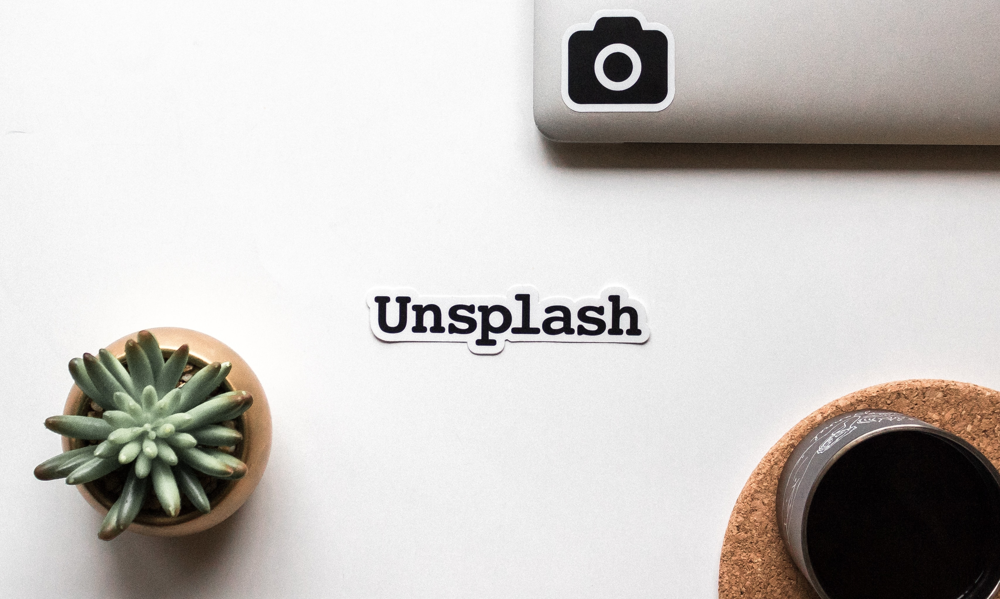
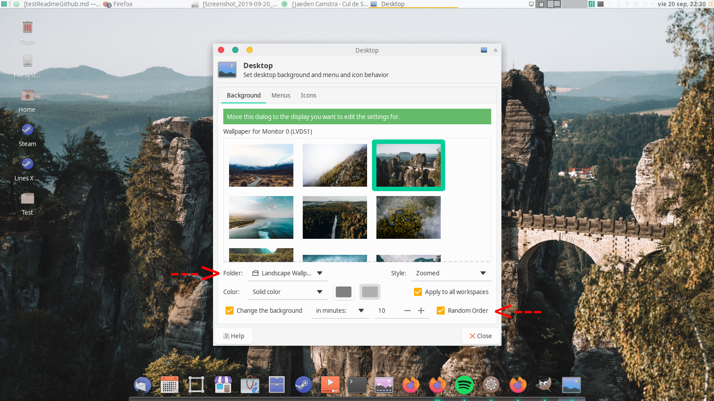

<!-- PROJECT SHIELDS -->
<!--
*** I'm using markdown "reference style" links for readability.
*** Reference links are enclosed in brackets [ ] instead of parentheses ( ).
*** See the bottom of this document for the declaration of the reference variables
*** for contributors-url, forks-url, etc. This is an optional, concise syntax you may use.
*** https://www.markdownguide.org/basic-syntax/#reference-style-links
-->

[![Forks][forks-shield]][forks-url]
[![Stargazers][stars-shield]][stars-url]


<!-- PROJECT LOGO -->
<br />
<p align="center">
  <a href="https://github.com/Benji3pr/Unsplash-Wallpapers">
    
  </a>

  <h3 align="center">Unsplash-Wallpapers</h3>


</p>


<!-- TABLE OF CONTENTS -->
## Table of Contents

* [About the Project](#about-the-project)
* [Getting Started](#getting-started)  
  * [Installation](#installation)
* [Usage](#usage)


<!-- ABOUT THE PROJECT -->
## About The Project

[![Product Name Screen Shot][product-Examplescreen]]

Repository of wallpapers obtained from Unsplash.com, a free stock high-quiality photos website.

Wallpapers separated in two categories:
* Landscape mode (Desktops)
* Portrait mode (Phones & Tablets)


<!-- GETTING STARTED -->
## Getting Started

The best way to use this repository is to clone it on your device, set the folder of your choice as the backgrounds folder and randomly change
background every x minute.


### Installation

1. Clone the repository
```sh
git clone https://github.com/Benji3pr/Unsplash-Wallpapers.git
```
2. Select the subfolder of your choice, Landscape or Portrait, as your wallpaper folder.

3. Update it every few weeks (or days :smile:) for new wallpapers
```sh
git pull
```


<!-- USAGE EXAMPLES -->
## Usage

<p align="center">
  <a href="https://github.com/Benji3pr/Unsplash-Wallpapers">
    
  </a>


</p>
